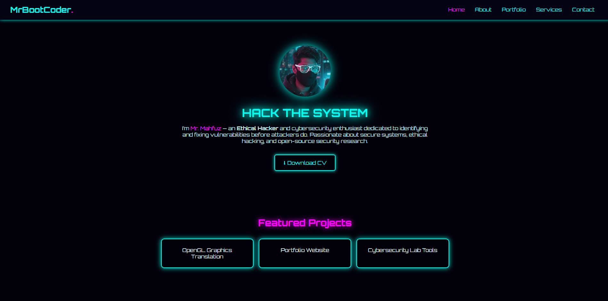

# 🌐 Mr. Mahfuz — Ethical Hacker Portfolio

> A modern, neon-themed cybersecurity portfolio website showcasing my projects, technical expertise, and professional services.



---

## 🚀 Overview

This portfolio was built to represent my identity as an **Ethical Hacker** and **Cybersecurity Enthusiast**.  
It features sections for my background, projects, offered services, and a secure contact form.

**Live Demo:** [🔗 Visit Website](https://yourusername.github.io/)

---

## 🧩 Tech Stack

| Technology | Purpose |
|-------------|----------|
| **HTML5** | Structure & markup |
| **CSS3 (custom)** | Responsive neon-glow styling |
| **JavaScript (Vanilla)** | Interactive navbar, toggles |
| **Google Fonts – Orbitron** | Futuristic typography |
| **SVG Icons** | Lightweight glowing vector icons |

---

## ✨ Features

- Responsive design (mobile / desktop friendly)  
- Neon cyber-aesthetic with animated glow effects  
- Modular sections: Home | About | Portfolio | Services | Contact  
- Smooth hamburger menu for small screens  
- Downloadable CV link  
- Accessible color contrast for dark theme  

---

## 🧠 Pages Included

| Page | Description |
|------|--------------|
| `index.html` | Main landing page with hero intro |
| `about.html` | Personal overview & technical skills |
| `portfolio.html` | Featured cybersecurity / coding projects |
| `services.html` | Cybersecurity services & training |
| `contact.html` | Contact form + social links |

---

## 🛠️ Installation & Usage

1. **Clone** the repository:
   ```bash
   git clone https://github.com/yourusername/portfolio.git
